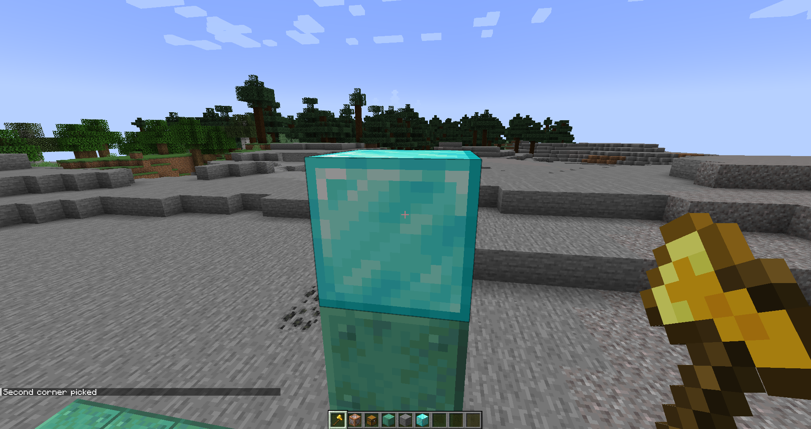

# Format

Use this tool to generate NBT areas or JSON advancement areas.

Examples of areas
```
NBT: [x=0,y=0,z=0,dx=0,dy=0,dz=0]
JSON: "position":{"x": {"min":-529,"max":4},"y":{"min":3,"max":106},"z":{"min":3,"max":112}}
```

This makes the pain-stacking time it takes to write all the numbers down a lot easier.

# How to use
### Step 1
- chose an area. Example, my area is between the diamond blocks
- Also get yourself a gold axe and make sure you are in creative mode
- Make sure either you have the mod for your single-player world or that the server has it

### Step 2
- left-click one of the corner blocks

### Step 3
- Right-click the other corner block

### Step 4
- Now write `/format json` or `/format nbt` to get the formated message.
- To copy it, press the message in the chat


# Looking for a server?
Get BisectHosting and save 25% off for new customers using code Lukas at checkout. Thanks for your support - it helps me develop this and other mods I make! #ad
[](https://bisecthosting.com/Lukas)

# Open source
Nearly all my mods are opensource and under MIT.
If you want to help the development, check out the [GitHub](https://github.com/lukasabbe/Format2.0)!